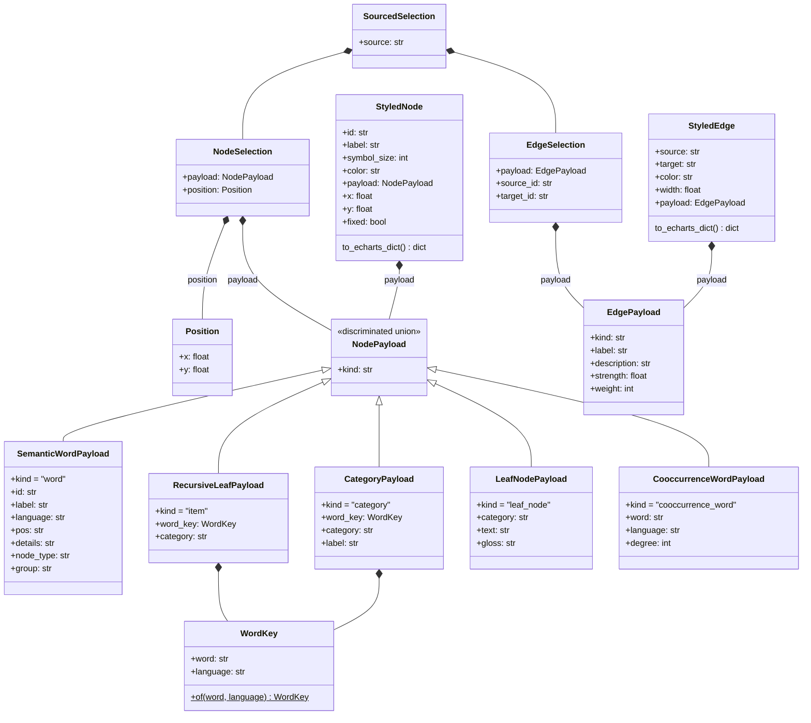

# Graph data model

This documents the typed data model behind `idiomapp/utils/graph_viz.py` -
the module that turns this app's word/translation data into the Semantic
Graph and Co-occurrence Network visualizations, and that powers clicking a
word to explore its details (synonyms, etymology, examples, ...) right
inside the graph.

## Two kinds of typed object, on purpose

- **Plain Python `@dataclass`es** (`WordKey`, `Position`, `StyledNode`,
  `StyledEdge`, `NodeSelection`, `EdgeSelection`, `SourcedSelection`) for
  things that only ever live inside this app's own Python code and never
  need to be re-checked from the outside.
- **Pydantic models** (every `NodePayload`/`EdgePayload` variant) for the
  pieces that get sent to the browser as JSON and come back from a click as
  JSON too. Pydantic's *discriminated unions* - a `kind` field that says
  which variant a piece of data is - turn "what did the user just click?"
  into real, validated parsing instead of digging through a loose dict and
  hoping the right keys are there.

The graph itself, while it's being built and grown, is a real
[`networkx.MultiDiGraph`](https://networkx.org/documentation/stable/reference/classes/multidigraph.html)
- not a hand-rolled pair of node/edge lists. `MultiDiGraph` specifically
because two words can legitimately be connected by more than one relation at
once (e.g. a translation edge *and* a cognate edge between the same pair),
and a simpler graph type would silently drop one of them. This isn't
hypothetical: `translation` edges come from LLM-reported word alignment (a
translation call now returns which source word maps to which target word,
not just the translated text) and `cognate` edges come from an independent
string-similarity heuristic (shared prefix/suffix, or high edit-distance) -
two different, genuinely separate signals that a real word pair can honestly
match both of at once, so both edges are kept side by side rather than one
formula trying to blend them into a single score.

## Diagram

A `classDiagram` (not a strict `erDiagram`) represents this model most
faithfully: several of the relationships below are "this is *one of* these
five kinds of thing" (a discriminated union), which maps naturally onto
`classDiagram`'s inheritance-style arrows and its explicit `direction TB`
for a vertical layout - `erDiagram`'s relationship notation is built for
database-style foreign keys, not sum types, and doesn't support a direction
directive at all.

## How a click becomes exploration

1. `StyledNode.to_echarts_dict()` / `StyledEdge.to_echarts_dict()` flatten a
   node or edge into the plain JSON dict ECharts needs, with the item's
   `NodePayload`/`EdgePayload` nested under a `"raw"` key. This is the
   **only** place this module produces an untyped dict - everything before
   it works with real objects.
2. The browser sends that same `"raw"` dict straight back when the user
   clicks it (`GRAPH_CLICK_JS`, in `graph_viz.py`, just spreads the item's
   own data - it never has to know what's inside `"raw"`).
2. `resolve_graph_click` parses that dict back into a `NodeSelection` or
   `EdgeSelection`, reconstructing whichever `NodePayload`/`EdgePayload`
   variant it actually is. A click that doesn't parse (a malformed or
   unrecognized event) is logged and treated as "nothing happened," not a
   crash.
3. `idiomapp/streamlit/app.py`'s `_dispatch_semantic_graph_click` pattern-
   matches on the payload type to decide what a click *means*:
   - `SemanticWordPayload` / `RecursiveLeafPayload` → analyze this word
     (through the same cache-backed `analyze_word_linguistics` call the
     dropdown+button flow already uses - never a second, separate path to
     the LLM), unless it's already been analyzed this session, in which
     case nothing happens at all.
   - `CategoryPayload` → toggle that category's results open or closed.
   - `LeafNodePayload` → nothing; it's a phrase or sentence, not a word.
4. `build_word_expansion` and `compose_semantic_graph_with_expansions`
   (both in `graph_viz.py`) turn the accumulated analyses and expanded
   categories into new `StyledNode`/`StyledEdge` objects layered onto the
   base translation graph, ready to flatten and send back to the browser
   on the next redraw.
